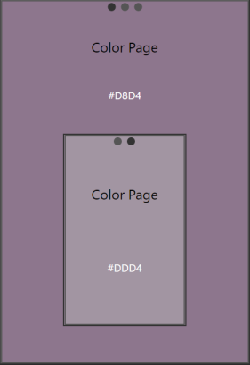

# Swipeable (touch devices only)
This project is showcasing how to apply an event factory to a Svelte-component in order to control swipe events and event forwarding better.

## Demo
Here is a screenshot. Click image to see live demo on netlify.

<figurealign="center">
    
    <figcaption>Screenshot of demo</figcaption>
</figure>

  
